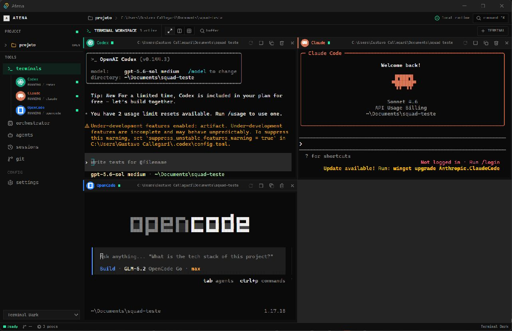
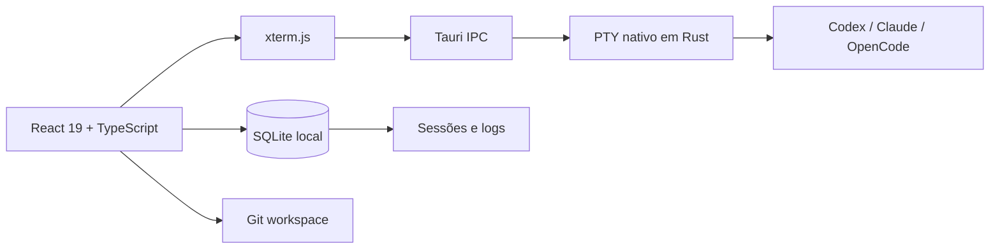

<div align="center">

<sup>Α Θ Η Ν Α</sup>

# ATENA

### Um centro de comando local para agentes de inteligência artificial

**Organize o trabalho. Preserve o contexto. Comande múltiplas inteligências.**

[](https://tauri.app/)
[](https://react.dev/)
[](https://www.rust-lang.org/)
[](https://www.typescriptlang.org/)


<br />

> Atena transforma diferentes CLIs de IA em uma única superfície operacional,
> com terminais reais, sessões persistentes e controle total sobre cada workspace.

</div>

---

<p align="center">
  
</p>

<p align="center"><sub>Codex, Claude Code e OpenCode trabalhando lado a lado no mesmo workspace.</sub></p>

## O que é o Atena?

Atena é um aplicativo desktop para quem trabalha com mais de um agente de IA ao mesmo tempo. Em vez de espalhar processos por janelas, abas e históricos desconectados, ele reúne cada CLI em um **workspace visual, persistente e local**.

O nome vem de **Atena**, deusa grega da estratégia e da sabedoria. A proposta do projeto segue a mesma ideia: não basta ter força computacional; é preciso coordená-la com clareza.

## O arsenal

| Capacidade | O que entrega |
| --- | --- |
| **Terminal Mesh** | Múltiplos PTYs reais, simultâneos e responsivos em grid. |
| **Context Keeper** | Terminais continuam ativos ao navegar entre as áreas do aplicativo. |
| **CLI Identity** | Nome, logo e cor mudam automaticamente para Codex, Claude, OpenCode e outras CLIs. |
| **Agent Orchestrator** | Fluxos especializados para frontend, backend, QA, revisão e pesquisa. |
| **Session Memory** | Logs e sessões armazenados localmente em SQLite. |
| **Repository Intel** | Visão de Git, branches e alterações sem sair do workspace. |
| **Command Surface** | Ações rápidas por Command Palette e atalhos de teclado. |
| **Local Runtime** | Dados, processos e contexto permanecem na sua máquina. |

## Identidade das CLIs

Cada ferramenta recebe uma assinatura visual própria no cabeçalho do terminal e no menu lateral.

| CLI | Identidade | Estado detectado |
| --- | --- | --- |
|  | Verde estratégico | `RUNNING`, `IDLE`, `STOPPED` |
|  | Laranja | `RUNNING`, `IDLE`, `STOPPED` |
|  | Azul elétrico | `RUNNING`, `IDLE`, `STOPPED` |
|  | Azul profundo | `OPEN`, `IDLE`, `STOPPED` |

O detector filtra sequências internas do terminal e mantém a identidade da CLI durante toda a execução do TUI.

## Arquitetura



```text
src/
├── components/          sistema visual e layout
├── features/
│   ├── agents/          agentes e orquestração
│   ├── terminal/        grid, PTY e identidade das CLIs
│   ├── sessions/        histórico local
│   ├── git/             inteligência do repositório
│   └── workspaces/      contexto de cada projeto
└── lib/                 IPC, banco e temas

src-tauri/
├── src/commands/pty.rs  ciclo de vida dos terminais nativos
└── src/lib.rs           backend Tauri e comandos locais
```

## Comece a comandar

### Pré-requisitos

- Windows 10/11 com WebView2
- Node.js 20.19 ou superior
- Rust stable com Cargo
- Pelo menos uma CLI instalada: Codex, Claude Code ou OpenCode

### Desenvolvimento

```powershell
git clone https://github.com/Nulera/Atena-multi-agent.git
cd Atena-multi-agent
npm install
npm run tauri:dev
```

### Build desktop

```powershell
npm run tauri:build
```

Os instaladores são gerados pelo Tauri em `src-tauri/target/release/bundle/`.

### Instalação no Windows

Baixe o arquivo `Atena_<versão>_x64-setup.exe` na página de
[Releases](https://github.com/Nulera/Atena-multi-agent/releases). O instalador
adiciona o Atena ao menu Iniciar e cria um atalho na área de trabalho.

Após a aprovação do pacote no repositório comunitário do WinGet:

```powershell
winget install --id AtenaProject.Atena --exact
```

Mantenedores podem enviar a primeira versão ao WinGet executando:

```powershell
.\scripts\submit-winget.ps1 -Version 0.1.0
```

## Comandos úteis

| Comando | Ação |
| --- | --- |
| `npm run tauri:dev` | Inicia frontend e aplicativo desktop. |
| `npm run build` | Valida TypeScript e gera o frontend. |
| `cargo check` | Verifica o backend Rust. |
| `npm run lint` | Executa a análise estática. |
| `npm run format` | Formata o projeto. |

## Atalhos

| Atalho | Ação |
| --- | --- |
| `Ctrl + K` | Abre a Command Palette. |
| `Ctrl + T` | Retorna ao workspace de terminais. |
| `Ctrl + N` | Abre a área de agentes. |

## Princípios

1. **Local por padrão.** Nenhum backend externo é necessário para operar o Atena.
2. **Contexto não é descartável.** Navegar pela interface não encerra seus terminais.
3. **Agentes precisam de supervisão.** Estado, CLI e atividade devem estar sempre visíveis.
4. **Ferramentas devem cooperar.** Codex, Claude e OpenCode dividem o mesmo espaço sem perder identidade.
5. **A interface serve ao trabalho.** Alta densidade, pouco ruído e ações previsíveis.

## Roadmap

- [x] PTY nativo e interativo
- [x] Grid persistente de terminais
- [x] Identidade visual automática por CLI
- [x] Sessões e logs locais
- [x] Orquestrador multiagente
- [x] Restauração segura de terminais e CLIs após reiniciar o aplicativo
- [x] Layouts de terminal salvos por workspace
- [x] Exportação e compartilhamento de sessões em Markdown e JSON
- [x] Releases assinadas e atualização automática

## Contribuindo

1. Crie uma branch a partir de `main`.
2. Mantenha mudanças focadas e compatíveis com os padrões existentes.
3. Execute `npm run build` e `cargo check`.
4. Abra um Pull Request explicando o problema e a solução.

---

<div align="center">

### ATENA

**Estratégia para coordenar inteligências.**

<sub>Construído com Tauri, Rust, React e TypeScript.</sub>

</div>
